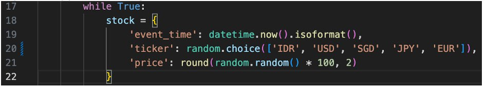

# TASK 1
Create a new topic name `stock_topic_test`, then publish the stock streaming data to the newly created topic. In producer.py, line 20 change data with this : 

 

# ANS
Pertama Jalankan docker compose, pastikan semua container berjalan dengan baik

Ubah codingan python sesuai yang diminta

Ubah juga file config.py agar sesuai dengan nama topic yang diminta

Jalankan file task1.py dan lihat hasilnya melalui UI redpanda

Sekarang publish data dengan menjalankan file python task1_consume.py

# END

