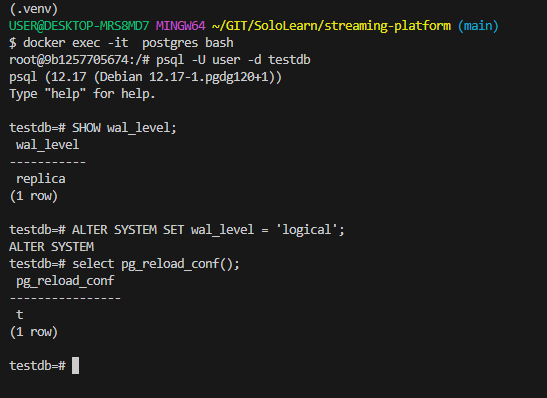
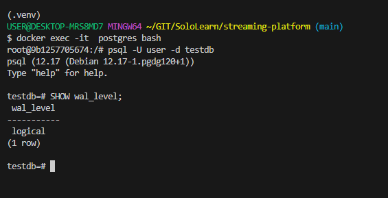
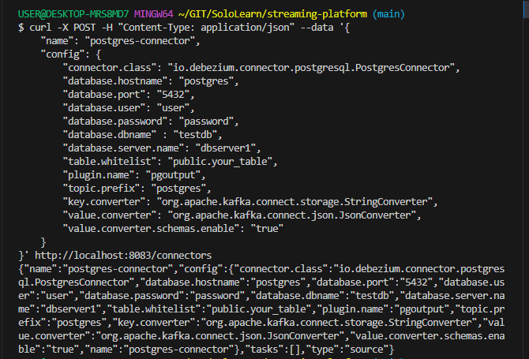
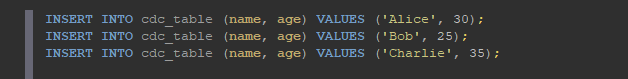
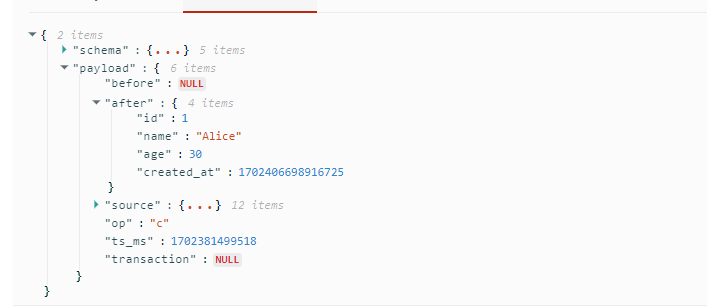
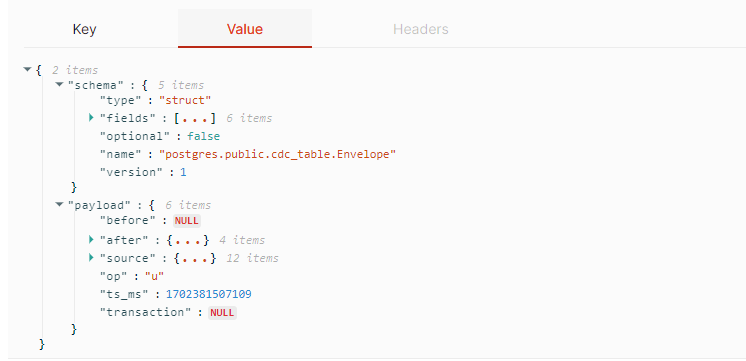
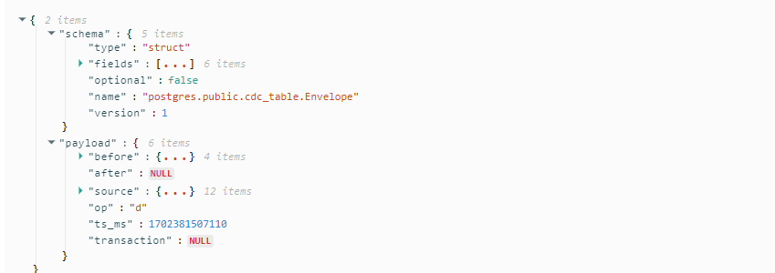

# TASK 2
Create new table with name `cdc_table ` then doing insert, update, and delete operation.

# ANS

Pertama kita jalankan postgres di terminal untuk memastikan wal level agar wal level nya logical

Jika `Replica` lakukan convert agar berubah menjadi logical

`Logical`

Jalankan Konektor postgres

Buat table db postgres dengan nama sesuai dengan perintah soal dan lakukan input data, delete, dan update. Kemudian buka redpanda dan lihat pada topic postgres.public.cdc_table untuk melihat history perubahan yang terjadi

`Input`

`Update`

`Delete`

# END

